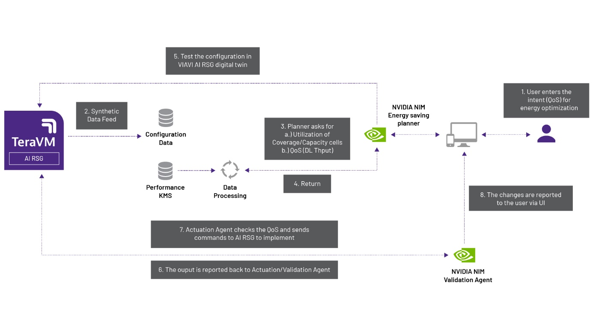

# Intent-Based RAN Energy Saving Blueprint

Closed-Loop RAN Energy Optimization using VIAVI AI RSG and LLM Agents

## Table of Contents

- [Overview](#overview)
- [Problem Statement](#problem-statement)
- [System Architecture](#system-architecture)
- [Agents](#agents)
  - [Planner Agent](#planner-agent)
  - [Validation Agent](#validation-agent)
- [Closed-Loop Execution Flow](#closed-loop-execution-flow)
- [Simulation Environment](#simulation-environment)
- [Repository Structure](#repository-structure)
- [Requirements](#requirements)
- [Setup](#setup)
- [Configuration Parameters](#configuration-parameters)
- [Output](#output)
- [Purpose](#purpose)
- [Contributors](#contributors)

## Overview

Intent-Based RAN Energy Saving Blueprint implements a validated, closed-loop simulation framework for evaluating AI-driven energy optimization strategies in a Radio Access Network (RAN).

The system integrates:

- VIAVI RAN Scenario Generator (AI RSG)
- VIAVI ADK
- Large Language Models (LLMs)
- A two-agent architecture:
  - Planner Agent**
  - Validation Agent**

The notebook simulates network behavior over time, generates energy-saving plans, validates them against QoS constraints, and applies approved actions within the simulation environment.

## Problem Statement

Reducing RAN energy consumption while maintaining strict QoS requirements is a core engineering challenge.

Aggressive cell sleeping strategies can degrade throughput if not carefully controlled. This project evaluates AI-assisted control policies inside a validated simulation loop before deployment.

## System Architecture



The system operates as a closed-loop pipeline:

```
UEReports + CellReports
        |
        v
KPI Processing Layer
        |
        v
State Store (LoopState + SQL)
        |
        v
Planner Agent (LLM)
  Generate proposed sleep/wake plan
        |
        v
AI RSG Simulation -- Impact Evaluation
        |
        v
Validation Agent (LLM)
  Approve / reject / adjust actions
        |
        v
AI RSG Simulation -- Apply Validated Actions
        |
        v
Updated Network State --> Next Iteration
```

Each iteration represents one simulation time interval.

## Agents

### Planner Agent

The Planner Agent is responsible for generating energy-saving plans.

**Inputs:**
- Current network KPIs
- Cell activity and sleep state
- Site throughput and utilization
- Operator optimization intent
- QoS constraints

**Output:**
- Proposed sleep/wake actions for network cells

The Planner Agent attempts to maximize energy efficiency while preserving network performance.

### Validation Agent

The Validation Agent ensures that Planner Agent actions are safe and QoS-compliant.

**Inputs:**
- Planner Agent recommendations
- Simulated KPI impact
- QoS thresholds
- Network topology and state

**Responsibilities:**
- Reject unsafe or QoS-violating actions
- Approve valid actions
- Ensure operational consistency

The Validation Agent acts as a safety layer before actions are applied to the simulation.

## Closed-Loop Execution Flow

Each iteration performs:

1. Load network state and KPIs
2. Generate action plan using Planner Agent
3. Simulate proposed actions using VIAVI AI RSG
4. Validate actions using Validation Agent
5. Apply validated actions to simulation
6. Record KPIs and system state
7. Advance simulation time

This creates a continuous validated control loop.

## Simulation Environment

The simulation is executed using:

- VIAVI ADK
- VIAVI RAN Scenario Generator (AI RSG)
- Scenario configuration file (`.conf`)

The notebook automatically installs the required ADK from the AI RSG host.

## Repository Structure

```
.
├── notebooks/
│   └── es_blueprint_poc.ipynb   # Main simulation notebook
├── data/
│   ├── UEReports.csv            # UE KPI dataset
│   └── CellReports.csv          # Cell KPI dataset
├── ai_rsg_config/
│   └── config.conf              # AI RSG scenario configuration
├── output/                      # Simulation results (charts, logs)
├── .env.example                 # Environment variable template
├── requirements.txt             # Python dependencies
├── setup.sh                     # One-time setup script
├── run.sh                       # Launch Jupyter Notebook
└── README.md
```

## Requirements

### System Requirements

- Python 3.10+
- Jupyter Notebook or Jupyter Lab
- Access to VIAVI AI RSG instance
- NVIDIA API key for LLM access (Obtain from https://build.nvidia.com/settings/api-keys)

### Python Dependencies

- pandas
- sqlalchemy
- requests
- python-dotenv
- langchain
- langchain-nvidia-ai-endpoints

The VIAVI ADK is installed automatically from the AI RSG host.

## Setup

1. **Clone the repository**

   ```bash
   git clone https://github.com/VIAVI-CTOO/es-blueprint-rsg.git
   cd es-blueprint-rsg
   ```

2. **Run the setup script**

   ```bash
   ./setup.sh
   ```

   This will create a virtual environment and install all dependencies.

   After setup, install the internal `viavi` package (authorized access required):

   ```bash
   source .venv/bin/activate
   pip install http://3.211.96.252:8000/adk
   ```

3. **Configure API key**

   Create a `.env` file:

   ```
   NVIDIA_API_KEY=<your_api_key>
   ```

   Available environment variables:

   | Variable | Description |
   |---|---|
   | `NVIDIA_API_KEY` | API key for NVIDIA AI endpoints |

4. **Run the notebook**

   ```bash
   ./run.sh
   ```

   Open `es_blueprint_poc.ipynb` and run the notebook from top to bottom.

## Output

The notebook produces:

- Planner Agent recommendations
- Validation Agent approval decisions
- Applied energy-saving actions
- QoS and throughput measurements
- Iteration summary across simulation

These outputs enable engineering evaluation of energy-saving strategies.

## Purpose

This repository provides an engineering framework for evaluating AI-assisted RAN energy optimization using validated, simulation-driven control loops.

It is intended for:

- RAN engineering experimentation
- Energy optimization evaluation
- AI-assisted network control development
- Simulation-based validation of control strategies

## Contributors

1. [Bimo Fransiscus](https://www.linkedin.com/in/fransiscusbimo/) — AI Engineer, CTO Office, VIAVI Solutions
2. [Mahdi Sharara](https://www.linkedin.com/in/mahdisharara/) — Research Scientist, CTO Office, VIAVI Solutions
3. [Georgy Myagkov](www.linkedin.com/in/georgy-myagkov-03a2486) — Wireless R&D Engineer, VIAVI Solutions
4. [Ari Uskudar](https://www.linkedin.com/in/ari-u-628b30148/) — Telco AI Principal, NVIDIA

## Disclaimer

*This Intent-Based RAN Energy Saving Blueprint is intended for Proof-of-Concept (PoC) and research purposes only. It is not designed, tested, or intended for production use. This blueprint downloads and uses 3rd party components from Viavi Solutions. The end users must use the latest and most stable version of the software. Any use of this blueprint in a production environment is entirely at the user's own risk. The authors and contributors accept no liability for any damages, service degradation, or losses arising from such use.*
